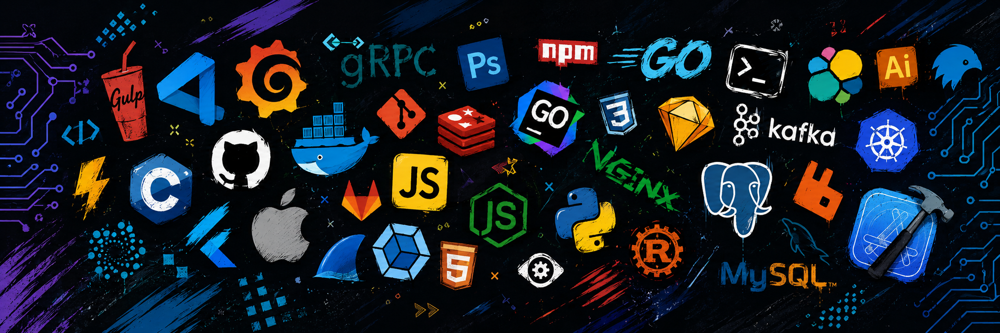

## Hey, I'm Clark 👋

Full stack dev from Ilocos Sur, Philippines. Been at it for about 5 years now,
mostly keeping real production systems alive rather than spinning up side
projects that die in a week. AWS certified too, if that matters to you —
badge is further down.

I lean backend — Node/Express, Prisma, PostgreSQL, serverless on AWS — but I'm
happy anywhere in the stack. Some things I've done that I'm proud of: led an
Android → Angular + Capacitor rewrite, moved auth over to Cognito and dropped
our crash rate ~70%, and I currently look after three production apps used by
2,000+ people.

I also build with agentic AI daily. Claude Code and Cursor are just part of how
I ship now, not a party trick.

**Portfolio:** [dev-clark-adam.vercel.app](https://dev-clark-adam.vercel.app)
**Currently:** open to remote work with foreign teams

---

### Skills

**Languages**

C# · Java · JavaScript · Kotlin · PHP · Python · SQL · TypeScript

**Frontend / Mobile**

Angular · Capacitor · Expo Go · Next.js · React · React Native · Redux · TanStack Query

**Backend**

.NET · Deno · Express · GraphQL · Laravel · Node.js · Prisma ORM · REST API design

**Databases**

PostgreSQL · MongoDB · SQL

**Testing**

Playwright · Vitest

**Tools**

Git · GitHub · Postman · VS Code

**AI Tools**

Claude Code · Cursor · Gemini

---

### Certifications

<table>
  <tr>
    <td width="150" align="center">
      
    </td>
    <td>
      <strong>AWS Certified Developer – Associate</strong> 
      Amazon Web Services  
      Lambda, DynamoDB, API Gateway, Cognito, IAM, CI/CD — basically the
      stuff I already reach for at work, so the exam mostly confirmed habits
      instead of teaching me new ones.  
      <a href="https://cp.certmetrics.com/amazon/en/public/verify/credential/94b3250c9bae43ba91a70e5a11803f72">Verify credential →</a>
    </td>
  </tr>
</table>

---

### Stuff I'm building

**[Ilocos Sur Property](https://ilocossurproperty.com)** — a live property
listing platform I built for a local broker. 52 active listings across three
cities. React Native + Express + Prisma + PostgreSQL, with Cloudinary and
Google Maps. Source is private, but I'm happy to walk you through the
architecture on a call.

**ISECO Notifier** — push notifications for power outages in my province.
ISECO only posts them to Facebook, which is useless if you're not scrolling,
so I built an event-driven pipeline: scraper → Supabase Edge Function → LLM
enrichment → FCM fan-out. Flutter client.

---

### From the archive 🗄️

**HI: Hand Ilocano** — my college thesis. A real-time Ilocano sign language
translator built with Python + MediaPipe, back when I was still figuring out
what I was doing. It won Best in Thesis, which I'm still pretty happy about.

Deprecated and no longer maintained — the dependencies have long since moved
on and I haven't touched it since defense. Leaving it here because I'm proud
of it, not because you should run it.

---

### What I'm into right now

Going deeper on system design and backend fundamentals — auth internals,
event-driven architecture, and actually getting good at testing.

📫 Say hi: [LinkedIn](https://www.linkedin.com/in/clark-adam-arconado-a759981a9/) · [Email](mailto:clarkadamarconado@gmail.com)
